# Document Management System (DMS) - Architecture Documentation

## Table of Contents
1. [Architecture Overview](#architecture-overview)
2. [System Architecture Diagram](#system-architecture-diagram)
3. [Component Architecture](#component-architecture)
4. [Data Architecture](#data-architecture)
5. [Security Architecture](#security-architecture)
6. [Deployment Architecture](#deployment-architecture)
7. [Integration Architecture](#integration-architecture)
8. [Technology Stack](#technology-stack)

---

## Architecture Overview

### 1.1 Architecture Principles
- **Microservices Architecture**: Loosely coupled, independently deployable services
- **API-First Design**: RESTful APIs and GraphQL for flexible integration
- **Cloud-Native**: Containerized applications with Kubernetes orchestration
- **Event-Driven**: Asynchronous processing with message queues
- **Security by Design**: Security integrated at every layer
- **Scalability**: Horizontal scaling capabilities for all components

### 1.2 Architecture Patterns
- **Layered Architecture**: Presentation, Business Logic, Data Access layers
- **CQRS**: Command Query Responsibility Segregation for read/write optimization
- **Event Sourcing**: Audit trail and state reconstruction capabilities
- **Circuit Breaker**: Fault tolerance and resilience patterns
- **API Gateway**: Centralized API management and routing

---

## System Architecture Diagram

---

## Component Architecture

### 3.1 Frontend Architecture

### 3.2 Backend Architecture

---

## Data Architecture

### 4.1 Database Schema

```mermaid
erDiagram
    USERS {
        bigint id PK
        varchar username UK
        varchar email UK
        varchar password_hash
        varchar first_name
        varchar last_name
        varchar department
        enum role
        boolean active
        timestamp created_at
        timestamp updated_at
    }

    DOCUMENTS {
        bigint id PK
        varchar title
        varchar filename
        varchar file_path
        varchar file_type
        bigint file_size
        enum document_type
        json metadata
        bigint uploader_id FK
        timestamp upload_date
        timestamp created_at
        timestamp updated_at
    }

    DOCUMENT_VERSIONS {
        bigint id PK
        bigint document_id FK
        int version_number
        varchar file_path
        varchar change_description
        bigint created_by FK
        timestamp created_at
    }

    DOCUMENT_PERMISSIONS {
        bigint id PK
        bigint document_id FK
        bigint user_id FK
        enum permission_type
        timestamp granted_at
        timestamp expires_at
    }

    WORKFLOWS {
        bigint id PK
        varchar name
        varchar description
        json workflow_definition
        enum status
        bigint created_by FK
        timestamp created_at
        timestamp updated_at
    }

    WORKFLOW_INSTANCES {
        bigint id PK
        bigint workflow_id FK
        bigint document_id FK
        json current_state
        enum status
        timestamp started_at
        timestamp completed_at
    }

    AUDIT_LOGS {
        bigint id PK
        varchar entity_type
        bigint entity_id
        varchar action
        json old_values
        json new_values
        bigint user_id FK
        varchar ip_address
        timestamp created_at
    }

    NOTIFICATIONS {
        bigint id PK
        varchar type
        varchar title
        text message
        json metadata
        bigint user_id FK
        boolean read
        timestamp created_at
        timestamp read_at
    }

    USERS ||--o{ DOCUMENTS : uploads
    USERS ||--o{ DOCUMENT_PERMISSIONS : has
    DOCUMENTS ||--o{ DOCUMENT_VERSIONS : has
    DOCUMENTS ||--o{ DOCUMENT_PERMISSIONS : has
    DOCUMENTS ||--o{ WORKFLOW_INSTANCES : triggers
    WORKFLOWS ||--o{ WORKFLOW_INSTANCES : creates
    USERS ||--o{ WORKFLOWS : creates
    USERS ||--o{ AUDIT_LOGS : performs
    USERS ||--o{ NOTIFICATIONS : receives
```

### 4.2 Data Flow Architecture

---

## Security Architecture

### 5.1 Security Layers

### 5.2 Authentication & Authorization Flow

---

## Deployment Architecture

### 6.1 Container Architecture

### 6.2 Environment Architecture

---

## Integration Architecture

### 7.1 API Integration Architecture

### 7.2 Event-Driven Architecture

---

## Technology Stack

### 8.1 Frontend Technologies

| Component | Technology | Version | Purpose |
|-----------|------------|---------|---------|
| **Web Framework** | React.js | 18.2.x | UI Framework |
| **Language** | TypeScript | 5.3.x | Type Safety |
| **UI Library** | Material-UI | 5.15.x | Component Library |
| **State Management** | Redux Toolkit | 2.0.x | State Management |
| **Data Fetching** | React Query | 5.0.x | Server State |
| **Routing** | React Router | 6.20.x | Navigation |
| **Forms** | React Hook Form | 7.47.x | Form Management |
| **Validation** | Yup | 1.4.x | Schema Validation |
| **HTTP Client** | Axios | 1.6.x | API Communication |

### 8.2 Backend Technologies

| Component | Technology | Version | Purpose |
|-----------|------------|---------|---------|
| **Runtime** | Java | 25 LTS | Programming Language |
| **Framework** | Spring Boot | 3.2.x | Application Framework |
| **Security** | Spring Security | 6.2.x | Authentication & Authorization |
| **Data Access** | Spring Data JPA | 3.2.x | Database Operations |
| **Database** | PostgreSQL | 16.x | Primary Database |
| **Cache** | Redis | 7.2.x | Caching & Sessions |
| **Search** | Elasticsearch | 8.11.x | Full-text Search |
| **Message Queue** | Apache Kafka | 3.6.x | Event Streaming |
| **OCR** | Tesseract | 5.3.x | Text Recognition |
| **Documentation** | Swagger/OpenAPI | 3.0.x | API Documentation |

### 8.3 Infrastructure Technologies

| Component | Technology | Version | Purpose |
|-----------|------------|---------|---------|
| **Containerization** | Docker | 24.0.x | Application Packaging |
| **Orchestration** | Kubernetes | 1.28.x | Container Orchestration |
| **Reverse Proxy** | Nginx | 1.25.x | Load Balancing |
| **API Gateway** | Kong | 3.4.x | API Management |
| **Monitoring** | Prometheus | 2.47.x | Metrics Collection |
| **Visualization** | Grafana | 10.2.x | Monitoring Dashboards |
| **Logging** | ELK Stack | 8.11.x | Log Management |
| **Storage** | MinIO/S3 | Latest | Object Storage |
| **CI/CD** | Jenkins | 2.426.x | Continuous Integration |

### 8.4 Mobile Technologies

| Component | Technology | Version | Purpose |
|-----------|------------|---------|---------|
| **Framework** | React Native | 0.72.x | Cross-platform Development |
| **iOS** | Swift | 5.9.x | Native iOS Features |
| **Android** | Kotlin | 1.9.x | Native Android Features |
| **Offline Storage** | SQLite | 3.43.x | Local Database |
| **State Management** | Redux Toolkit | 2.0.x | State Management |
| **Navigation** | React Navigation | 6.1.x | Mobile Navigation |
| **Push Notifications** | Firebase | 10.7.x | Push Notifications |

---

## Architecture Decision Records (ADRs)

### ADR-001: Microservices Architecture
**Decision**: Adopt microservices architecture for the DMS system.
**Rationale**: 
- Independent scaling of services
- Technology diversity
- Fault isolation
- Team autonomy

### ADR-002: Event-Driven Communication
**Decision**: Use Apache Kafka for inter-service communication.
**Rationale**:
- Asynchronous processing
- Event sourcing capabilities
- High throughput
- Fault tolerance

### ADR-003: API-First Design
**Decision**: Design APIs first, then implement applications.
**Rationale**:
- Better integration capabilities
- Clear contracts
- Parallel development
- Future flexibility

### ADR-004: Container-First Deployment
**Decision**: Use Docker containers and Kubernetes orchestration.
**Rationale**:
- Consistent environments
- Scalability
- Resource efficiency
- DevOps automation

---

## Performance Considerations

### 9.1 Scalability Patterns
- **Horizontal Scaling**: All services designed for horizontal scaling
- **Database Sharding**: PostgreSQL sharding for large datasets
- **Caching Strategy**: Multi-level caching (Redis, CDN, Browser)
- **Load Balancing**: Multiple load balancing strategies

### 9.2 Performance Optimization
- **Database Optimization**: Indexing, query optimization, connection pooling
- **Caching**: Redis for session and data caching
- **CDN**: Content delivery network for static assets
- **Compression**: Gzip compression for API responses

### 9.3 Monitoring & Observability
- **Metrics**: Prometheus for metrics collection
- **Logging**: Centralized logging with ELK stack
- **Tracing**: Distributed tracing for request flows
- **Alerting**: Proactive alerting for system issues

---

## Conclusion

This architecture provides a robust, scalable, and maintainable foundation for the Document Management System. The microservices architecture ensures flexibility and scalability, while the comprehensive security and monitoring layers provide enterprise-grade reliability and compliance.

The architecture supports:
- **High Availability**: 99.9% uptime target
- **Scalability**: Handle 1000+ concurrent users
- **Security**: Enterprise-grade security controls
- **Performance**: Sub-second response times
- **Maintainability**: Clear separation of concerns
- **Extensibility**: Easy addition of new features

This architecture will evolve with the system requirements and technological advances, ensuring long-term viability and success of the DMS platform.
